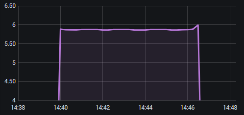

[](https://github.com/gistart/prometheus-push-client/actions)
[](https://codecov.io/gh/gistart/prometheus-push-client)

# prometheus-push-client

Push metrics from your regular and/or long-running jobs to existing Prometheus/VictoriaMetrics monitoring system.

Currently supports pushes directly to VictoriaMetrics via UDP and HTTP using InfluxDB line protocol as [described here](https://docs.victoriametrics.com/Single-server-VictoriaMetrics.html?highlight=telegraf#how-to-send-data-from-influxdb-compatible-agents-such-as-telegraf).

For pure Prometheus setups, pushes into StatsD/statsd-exporter in StatsD format via UDP are supported ([see exporter docs](https://github.com/prometheus/statsd_exporter#with-statsd)). Prometheus and StatsD metric types are not fully compatible, so currenly all metrics become StatsD gauges, but `rate`, `increase`, `histogram_quantile` and other PromQL functions produce same results as if types never changed.

Install it via pip:

```sh
pip install prometheus-push-client
```

## Metrics

This library uses `prometheus-client` metric implementation, but adds some minor tweaks.

### Separate registry

New metric constructors use separate `PUSH_REGISTRY` as a default, not to interfere with other metrics already defined and monitored in existing projects.

### Default labelvalues

With regular prometheus_client, defaults may be defined for either _none_ or _all_ the labels (with `labelvalues`), but that's not enough. Moreover `labelvalues` sometimes doesn't work as expected.

We probably want to define _some_ defaults, like `hostname`, or more importantly, **if we use VictoriaMetrics cluster**, we always need to push label `VictoriaMetrics_AccountID=<int>` (usually 1) or else our metrics will be ignored.

Following example shows how to use defaults, and how to override them if necessary.

```python
import prometheus_push_client as ppc


counter1 = ppc.Counter(
    name="c1",
    labelnames=["VictoriaMetrics_AccountID", "host", "event_type"],
    default_labelvalues={
        "VictoriaMetrics_AccountID": 1,
        "host": socket.gethostname(),
    }
)


# regular usage
counter1.labels(event_type="login").inc()

# overriding defaults
counter1.labels(host="non-default", event_type="login").inc()
# same effect as above: defaults are applied in `labelvalues`
# order for "missing" labels in the beginning
counter1.labels("non-default", "login").inc()
```

Metrics with no labels are initialized at creation time. This can have unpleasant side-effect: if we initialize lots of metrics not used in currently running job, batch clients will have to push their non-changing values in every synchronization session.

To avoid that we'll have to properly isolate each task's metrics, which can be impossible or rather tricky, or we can create metrics with default, non-changing labels (like `hostname`). Such metrics will be initialized on fisrt use (inc), and we'll be pushing only those we actually used.

## Batch clients

Batch clients spawn synchronization jobs "in background" (meaning in a thread or asyncio task) to periodically send all metrics from `ppc.PUSH_REGISTRY` to the destination.

Clients will attempt to stop gracefully, synchronizing registry "one last time" after job exits or crashes. Sometimes this _may_ mess up Grafana sampling, but the worst picture I could artifically create looks like this:



Best way to use them is via decorators / context managers. These clients are intended to be used with long running, but finite tasks, which could be spawned anywhere, therefor not easily accessible by the scraper. If that's not the case -- just use "passive mode" w/ the scraper instead.

``` python
def influx_udp_async(host, port, period=15.0):
def influx_udp_thread(host, port, period=15.0):
def influx_http_async(url, period=15.0):
def influx_http_thread(url, period=15.0):
def statsd_udp_async(host, port, period=15.0):
def statsd_udp_thread(host, port, period=15.0):
```

Usage example:

```python
import prometheus_push_client as ppc


req_hist = ppc.Histogram(
    name="external_requests",
    namespace="acme"
    subsystem="job123",
    unit="seconds",
    labelnames=["service"]
)


@ppc.influx_udp_async("victoria.acme.inc.net", 9876, period=15)
async def main(urls):
    # the job ...
    req_hist.labels(gethostname(url)).observe(response.elapsed)

# OR

async def main(urls):
    async with ppc.influx_udp_async("victoria.acme.inc.net", 9876, period=15):
        # the job ...
        req_hist.labels(gethostname(url)).observe(response.elapsed)
```


## Streaming clients

If for some reason every metric change needs to be synced, UDP streaming clients are implemented in this library.

```python
def influx_udp_aiostream(host, port):
def influx_udp_stream(host, port):
def statsd_udp_aiostream(host, port):
def statsd_udp_stream(host, port):
```

Usage is completely identical to batch clients' decorators / context managers.

:warning: Histogram and Summary `.time() decorator` doesn't work in this mode atm, because it can't be easily monkey-patched.